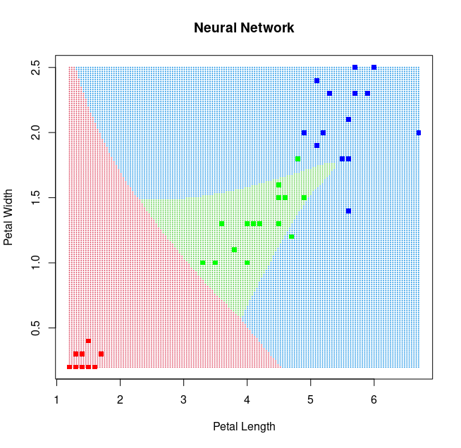

```{r setup, include=FALSE}
knitr::opts_chunk$set(echo = TRUE)
```
## (Statistical) Classification: What is it anyway?

-The problem of identifying which of a set of categories an observation belongs to.

-E.g. assigning an incoming email to "spam" or "inbox" mailbox.

-Classification can be thought of as two separate problems – binary classification and multiclass classification.

## Methods of Classification

-We implement the following methods of classification on a well known dataset and present our results:

- Naive Bayes
- k-Nearest Neighbours
- Neural Networks
- Random Forest
- Decision Trees
- Logistic Regression
- Support Vector Machine

-We explain and present results from three methods: Naive Bayes, k- Nearest Neighbours and Neural Networks. 

## Dataset

-The Iris Dataset contains four features (length and width of sepals and petals) of 50 samples of three species of Iris (Iris setosa, Iris virginica and Iris versicolor).

-The dataset is often used in data mining, classification and clustering examples and to test algorithms.


## Dataset

-We split the data into training and testing set in the ratio 67:33 repectively.

{width=200px}

## Dataset

{width=200px}

## Naive Bayes

-Naive Bayes classifiers are a family of simple "probabilistic classifiers" based on applying Bayes' theorem with strong (naive) independence assumptions between the features.

-The assumption is that the features are independent, i.e presence of one particular feature does not affect the other. Hence the adjective ``naive".

-Requires a small number of training data to estimate the parameters necessary for classification.

-Bayes theorem expressed as:
$$P(y|X) = \frac{P(X|y)P(y)}{P(X)}$$
-$y$ is the category variable, and $X$ represent the parameters/features.

## Naive Bayes

-We obtain the following result from a Naive Bayes implementation for classifying the Iris dataset.

{width=200px}

## k-Nearest Neighbours

-A non-parametric supervised learning method.

-Uses proximity to make classifications or predictions about the grouping of an individual data point.

-Proximity is determined by using a distance metric, e.g. Euclidean distance.

-Object is assigned to the class it is most common with among its k nearest neighbors.

## k-Nearest Neighbours

{width=200px}

## Neural Networks

-Neural networks (NNs) are computing systems inspired by the biological neural networks that constitute animal brain.

-They learn forming probability-weighted associations between "input" and "result". 


## Neural Networks

-For classification tasks, NNs utilize an activation function, for example a logistic function:

$$f(x) = \frac{L}{1 + e^{-k(x - x_0)}}$$
{width=250px} 
<!-- Adjust to center -->

## Neural Networks

{width=200px}

## Neural Networks

{width=200px}

## Cross Validation

## Summary

-Classification accuracy scores:
<!-- create table -->

NB   |kNN    |   Logistic   |  SVM      |    NN |   DT      |    RF
     +       +              +           +       +           +
0.96 |   1   |   0.9787234  | 0.9787234 |   NA  |  0.9574468|   0.9574468


## Conclusions

- We observe that kNN classifies the data with 100% accuracy. 
- Neural Networks, although computationally efficient, is not an efficient method in this scenario.
- For best results, the method to be used should be carefully chosen by taking the data features into account. 

## References

- Gareth James, Daniela Witten, Trevor Hastie, Robert Tibshirani. An Introduction to Statistical Learning : with Applications in R. Springer, 2013.

- McCulloch, Warren; Walter Pitts (1943). "A Logical Calculus of Ideas Immanent in Nervous Activity". Bulletin of Mathematical Biophysics. 5 (4): 115–133

